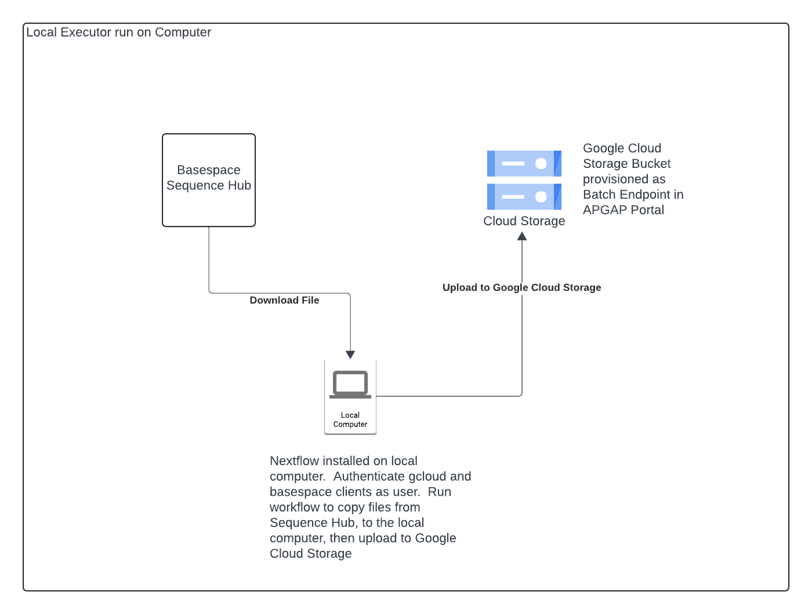
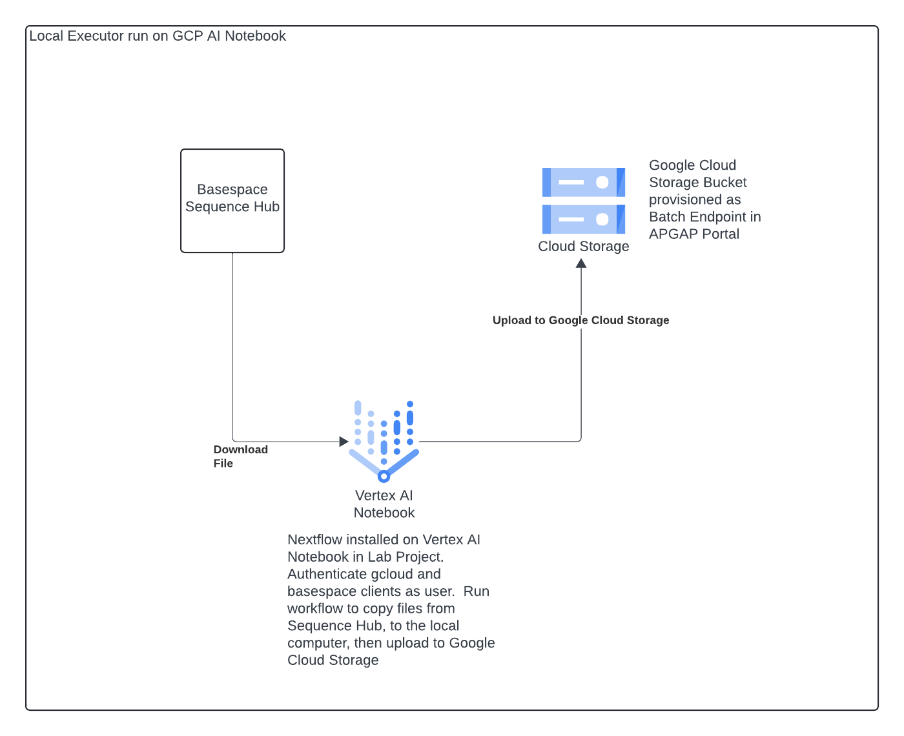
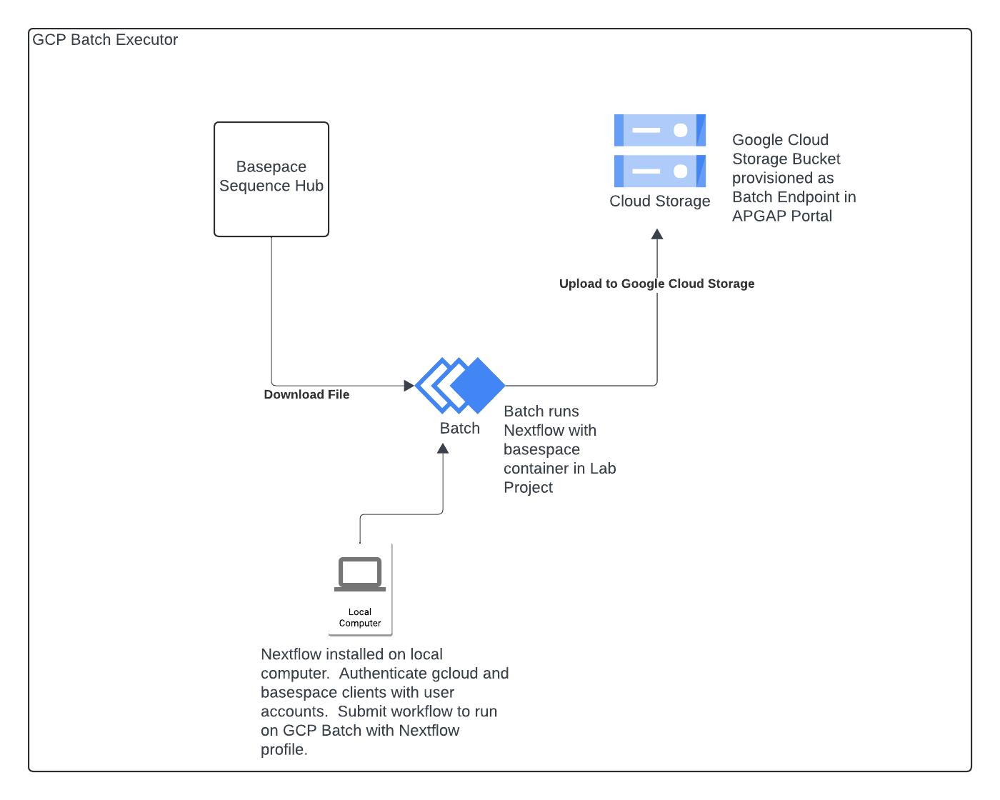

# Nextflow Basespace Copy
Nextflow workflow to copy files from Illumina Sequence Hub using the Basespace client.  The current supported output is to Google Cloud Storage.  

The Nextflow local executor running from your computer is the fastest method to copy files.  This can also be run from a Google Cloud VM or Notebook.  If files are too large to fit on your local device or there are a large amount of files to copy then the Google Cloud Batch NextFlow executor can be used.

## Running Workflow

### Local Nextflow Executor on Computer

Below is the architecture for running the local Nextflow executor on a Computer that integrates with Basespace Sequence Hub and Google Cloud Storage.



To run with local executor perform the following.

1. Create a Nextflow Endpoint in the APGAP Portal.  This will be the output bucket to copy files from Basespace.
1. Ask a GCP Administrator to grant the `Storage Object User` role on the bucket created from the previous step.
1. Clone this repo with a `git clone`
1. The next step uses the Google Cloud CLI.  If not installed download [here](https://docs.cloud.google.com/sdk/docs/install-sdk) 
1. If not already logged in enter `gcloud auth login` from the command line to login.  This will prompt you to click a browser link.  Login in with the Google account associated with APGAP.
1. Set these credentials to be your default credentials with `gcloud auth application-default login` 
1. The next step uses the Illumina Basespace client.  If not installed download [here](https://developer.basespace.illumina.com/docs/content/documentation/cli/cli-overview)
1. If not already authenticated enter `bs auth` to authenticate with the basespace client on the command line.  This will prompt you to click on a browser link to login.
1. Obtain the Basespace Project Id with `bs project list`.  Identify the `Id` for the project name you would to like to download from. 
1. Show files in the project.  Replace Id with the Id from the output of the project list from the previous step. `bs contents project -i <project ID>`
1. Update the `input_files` variable with the file Ids in [params.yml](./params.yml) with the file IDs to copy.
1. Update the `outdir` variable in [params.yml](./params.yml) with the Google Cloud Storage path from the Nextflow Endpoint created in step 1.
1. Run the nextflow pipeline with the following command.
```
 nextflow run main.nf  -params-file params.yml
```

### Local Nextflow Executor on GCP Vertex AI Notebook

Below is the architecture for running the local Nextflow executor on a GCP Vertex AI Notebook Instance that integrates with Basespace Sequence Hub and Google Cloud Storage.



To run with local executor on a GCP Vertex AI Notebook perform the following.

1. Create a Nextflow Endpoint in the APGAP Portal.  This will be the output bucket to copy files from Basespace.
1. Ask a GCP Administrator to grant the `Storage Object User` role on the bucket created from the previous step.
1. Access the Notebook from the Notebook link in the APGAP Portal.
1. Start a Terminal Session
1. Clone this repo with a `git clone`
1. Install Java and Nextflow with below commands.
    ```
    sudo apt update
    sudo apt install openjdk-17-jdk
    ```
1. Install Nextflow with below commands.
    ```
    curl -s https://get.nextflow.io | bash
    chmod +x nextflow
    mkdir -p $HOME/.local/bin
    mv nextflow $HOME/.local/bin/
    export PATH="$PATH:$HOME/.local/bin"
    ```
1. Validate the Nextflow install by running `nextflow info`
1. If not already authenticated enter `bs auth` to authenticate with the basespace client on the command line.  This will prompt you to click on a browser link to login.
1. Obtain the Basespace Project Id with `bs project list`.  Identify the `Id` for the project name you would to like to download from. 
1. Show files in the project.  Replace Id with the Id from the output of the project list from the previous step. `bs contents project -i <project ID>`
1. Update the `input_files` variable with the file Ids in [params.yml](./params.yml) with the file IDs to copy.
1. Update the `outdir` variable in [params.yml](./params.yml) with the Google Cloud Storage path from the Nextflow Endpoint created in step 1.
1. Run the nextflow pipeline with the following command.
    ```
    nextflow run main.nf  -params-file params.yml
    ```

### Google Cloud Nextflow Executor

Below is the architecture for submitting Nextflow to the Google Cloud Batch Nextflow executor that integrates with Basespace Sequence Hub and Google Cloud Storage.



To run with the GCP Batch executor perform the following.

1. Create a Nextflow Endpoint in the APGAP Portal.  This will be the output bucket to copy files from Basespace.
1. Ask a GCP Administrator to perform the following.
    * Grant the `Storage Object User` role on the bucket created from the previous step.
    * Create a work directory bucket in the Lab Project and grant your account the `Storage Object User` role
    * Grant your account the `Batch Job Editor` role on the Lab Project
    * Grant the `Service Account User` role on the Seqera Service Account for the Lab project
1. Clone this repo with a `git clone`
1. The next step uses the Google Cloud CLI.  If not installed download [here](https://docs.cloud.google.com/sdk/docs/install-sdk) 
1. If not already logged in enter `gcloud auth login` from the command line to login.  This will prompt you to click a browser link.  Login in with the Google account associated with APGAP.
1. Set these credentials to be your default credentials with `gcloud auth application-default login` 
1. The next step uses the Illumina Basespace client.  If not installed download [here](https://developer.basespace.illumina.com/docs/content/documentation/cli/cli-overview)
1. If not already authenticated enter `bs auth` to authenticate with the basespace client on the command line.  This will prompt you to click on a browser link to login.
1. Obtain the Basespace Project Id with `bs project list`.  Identify the `Id` for the project name you would to like to download from. 
1. Show files in the project.  Replace Id with the Id from the output of the project list from the previous step. `bs contents project -i <project ID>`
1. Update the `input_files` variable with the file Ids in [params.yml](./params.yml) with the file IDs to copy.
1. Update the `outdir` variable in [params.yml](./params.yml) with the Google Cloud Storage path from the Nextflow Endpoint created in step 1.
1. Set the Google Cloud variables in the [params.yml](./params.yml).  The `gcpProject` variable if the Google Cloud Project setup for you Project.  The service account email is the Seqera service account.  The network and subnetwork are in your project.  Work with a Platform Admin if you need help determining these values.  An example is below.

    ```
    gcpProject: 'tes4-apgap-project-3de8'
    serviceAccountEmail: 'seqera-sa@tes4-apgap-project-3de8.iam.gserviceaccount.com'
    network: 'projects/tes4-apgap-project-3de8/global/networks/tes4-network-dzl1'
    subnetwork: 'projects/tes4-apgap-project-3de8/regions/us-central1/subnetworks/tes4-subnetwork-dzl1'
    ```

1. Obtain the basespace auth token.  This is located in `~/.basespace/default.cfg` in your home directory on macOS and Linux.  On Windows it is `C:\Users\<UserName>\.basespace\default.cfg`
1. Run nextflow with the following command including the token obtained from previous step.  Note that Nextflow does not currently support the `secretVariable` parameter for passing in the path to a Google Cloud Secret Manager path so the token is sent via the command line.

```
nextflow run main.nf  -params-file params.yml  -profile google-batch --basespace_api_token <token>
```

## Updating the Container Image

A container image is used with Google Cloud Batch.  To run with a different image modify the [params.yml](./params.yml) to a different image tag or path.

## Modifying Basespace File Copy behavior

To modify the logic of the file copies modify the `script` section in [main.nf](./main.nf).  